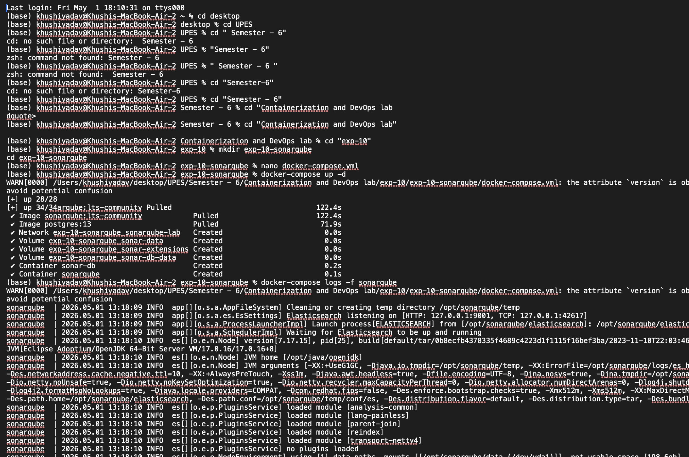
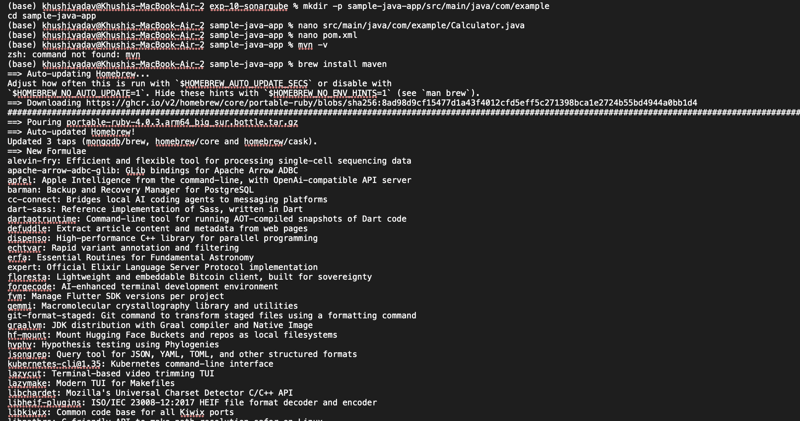
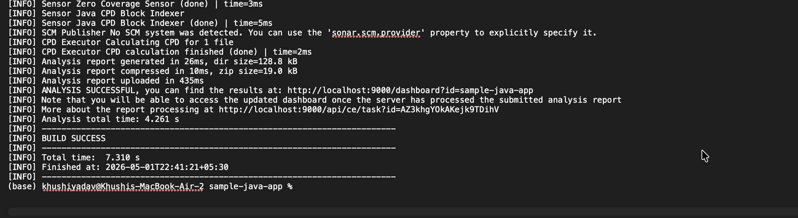
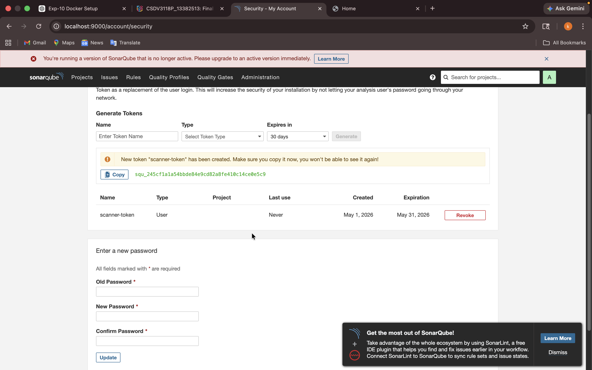
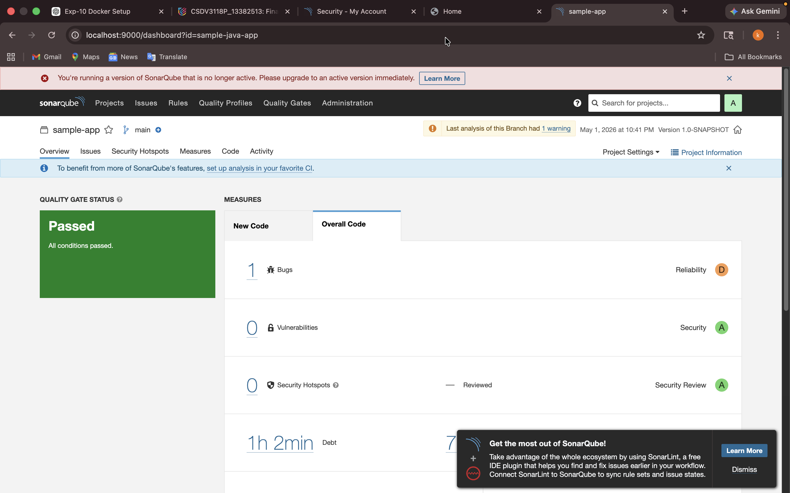
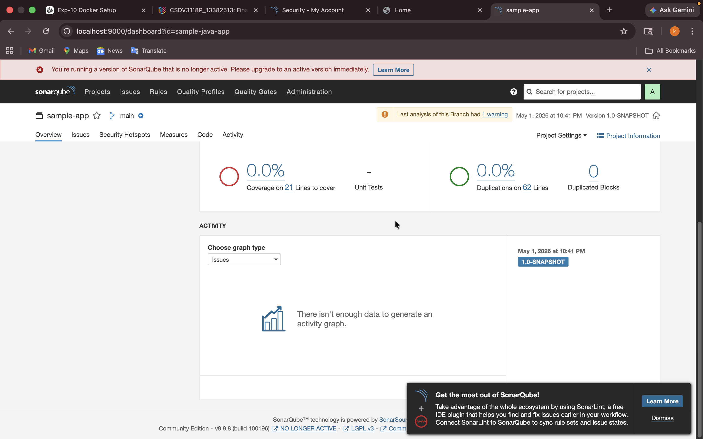

# Lab 10: CI/CD Pipeline with Jenkins and SonarQube


## Introduction
This lab demonstrates how to automate the build, test, and code quality analysis of a Java application using Jenkins and SonarQube. By the end, you will have a working pipeline that checks your code for errors and quality issues every time you push changes.

## Prerequisites
- Docker and Docker Compose installed
- Basic knowledge of Java and Maven
- Familiarity with Jenkins and SonarQube concepts

## Project Structure
```
Lab10/
├── docker-compose.yml
├── jenkinsfile
├── readme.md
├── sample-java-app/
│   ├── pom.xml
│   └── src/
│       └── main/
│           └── java/
└── ...
```

## Step-by-Step Instructions
1. **Clone the repository**
   ```sh
   git clone <repo-url>
   cd Lab10
   ```
2. **Start Jenkins and SonarQube using Docker Compose**
   ```sh
   docker-compose up -d
   ```
3. **Access Jenkins**
   - Open your browser and go to `http://localhost:8080`
   - Complete the initial setup and install recommended plugins
4. **Access SonarQube**
   - Go to `http://localhost:9000`
   - Log in with default credentials (admin/admin)
5. **Configure Jenkins Pipeline**
   - Create a new pipeline job
   - Use the provided `jenkinsfile` for pipeline configuration
6. **Run the Pipeline**
   - Trigger a build and observe the stages: build, test, and code analysis

## Jenkins Pipeline Overview
The Jenkins pipeline defined in `jenkinsfile` automates the following tasks:
- Build the Java application using Maven
- Run unit tests
- Analyze code quality with SonarQube
- Archive build artifacts

## SonarQube Integration
SonarQube is used to analyze the code for bugs, vulnerabilities, and code smells. The pipeline sends analysis results to SonarQube, which you can review in the SonarQube dashboard.

## Screenshots
Below are screenshots showing the setup and results at each stage:









## Troubleshooting
- If Jenkins or SonarQube do not start, check Docker logs for errors.
- Ensure ports 8080 (Jenkins) and 9000 (SonarQube) are not in use by other applications.
- If SonarQube analysis fails, verify the SonarQube server URL and authentication token in Jenkins.

## Conclusion
You have now set up a basic CI/CD pipeline with Jenkins and SonarQube for a Java application. This setup can be extended to include more advanced features like deployment, notifications, and additional quality gates.

---

Feel free to experiment and modify the pipeline to suit your project needs. Happy coding!