# Experiment 1
### Note:- As I am a mac-user I have performed the experiment on Someone else WINDOWS system.

## Comparison of VMs and containers using Ubuntu and Nginx

## Objective
1. To understand the conceptual and practical differences between Virtual Machine and Container.
2. To install and configure a Virtual Machine using VirtualBox and Vagrant on windows.
3. To install and configure Containers using Docker inside WSL.
4. To deploy on Ubuntu-based Nginx web server in both environments.
5. To compare resource utilization, performance, and operational characteristics of VMs and Containers.

## Theory
Virtualization and containerization are modern technologies used to run applications in isolated environments. A Virtual Machine (VM) emulates a complete physical system and runs its own operating system using a hypervisor. In this experiment, Ubuntu is installed as a VM using VirtualBox and Vagrant. VMs provide strong isolation but consume more system resources and have slower startup times due to the presence of a full guest OS.

Containers, on the other hand, are lightweight and share the host operating system’s kernel. Using Docker inside WSL, an Ubuntu-based Nginx container is deployed. Containers start faster, use fewer resources, and are highly portable, making them suitable for modern cloud and microservices-based applications.

Ubuntu is used as the base operating system in both environments for consistency, while Nginx is deployed as the web server due to its high performance and low resource usage. By deploying Nginx on both a VM and a container, this experiment compares resource utilization, performance, and operational characteristics of virtual machines and containers.

### Step 1: Install VirtualBox and vagrant.
Download and install Oracle VirtualBox and vagrant. 
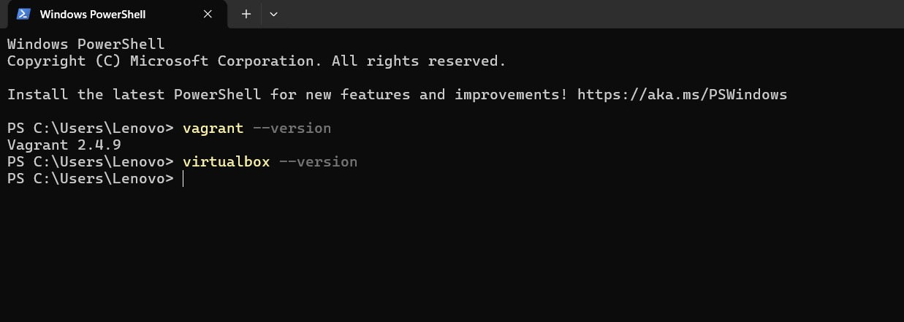

### Step 2: Install ubuntu
Install ubuntu   
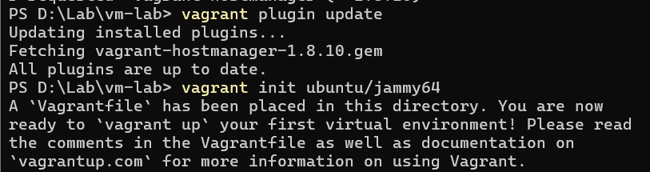

### Step 3: start the VM
Run `vagrant up` to create and boot the Ubuntu virtual machine.  
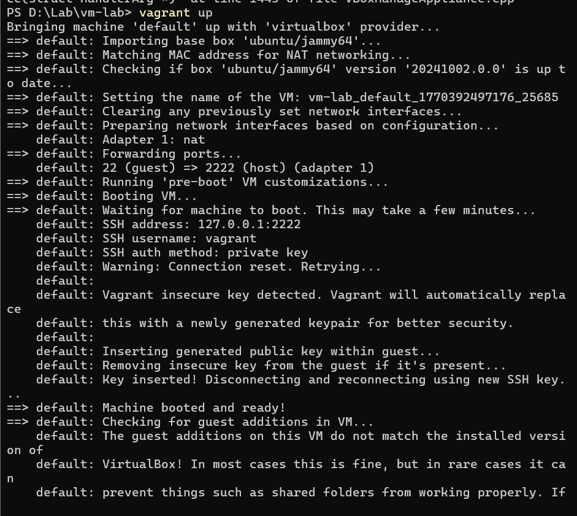

### Step 4: Access the VM
Use `vagrant ssh` to log into the Ubuntu VM. 
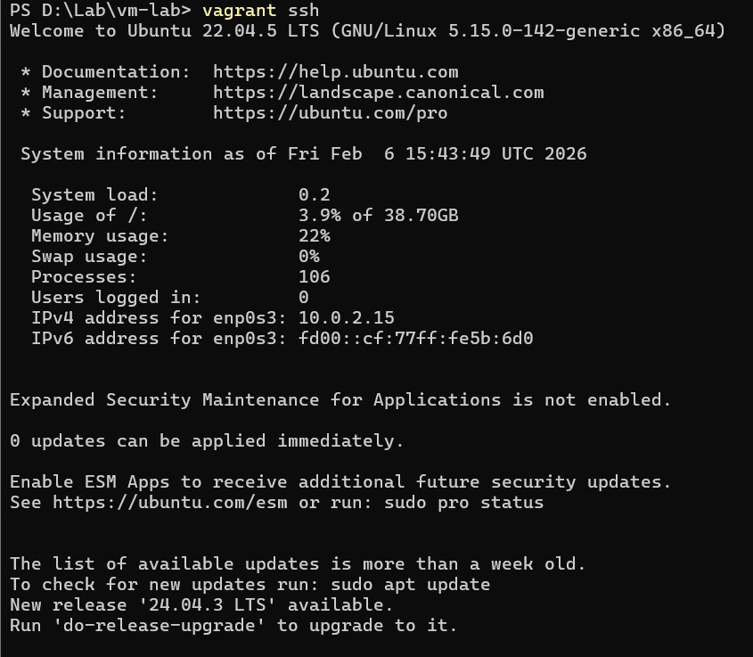

### Step 5: Verifying. 
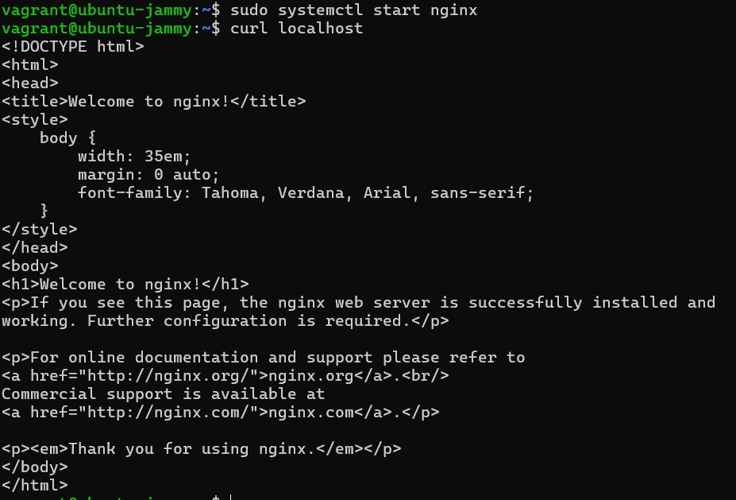

### Step 6: Destroying and halting VMs
Use `vagrant halt`and `vagrant destroy` to stop and destroy the VM.  
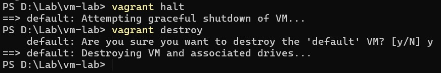

### Step 7: Checking wsl  
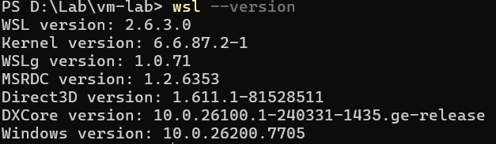

---

### Step 8: Configuring
Install and configure WSL to run Linux environment on Windows.  
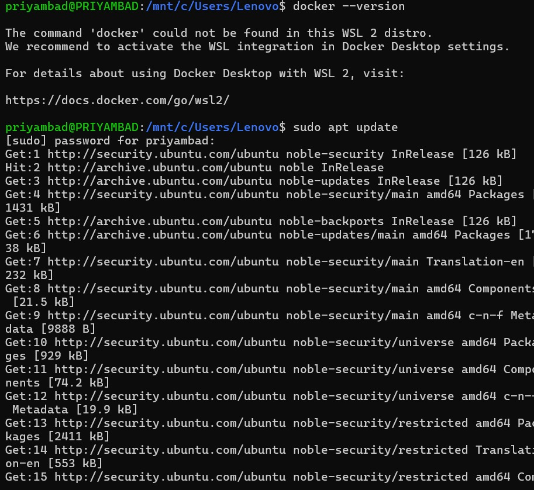

### Step 9: Install Docker inside WSL
Install Docker Engine inside the WSL Ubuntu environment.  
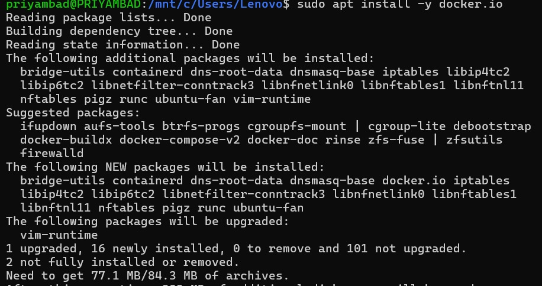

### Step 10: Verify Docker Installation
Check Docker version and status to confirm successful installation.  
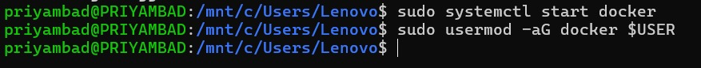

### Step 11: Install Nginx in Container
Install and run Nginx inside the Docker container.  
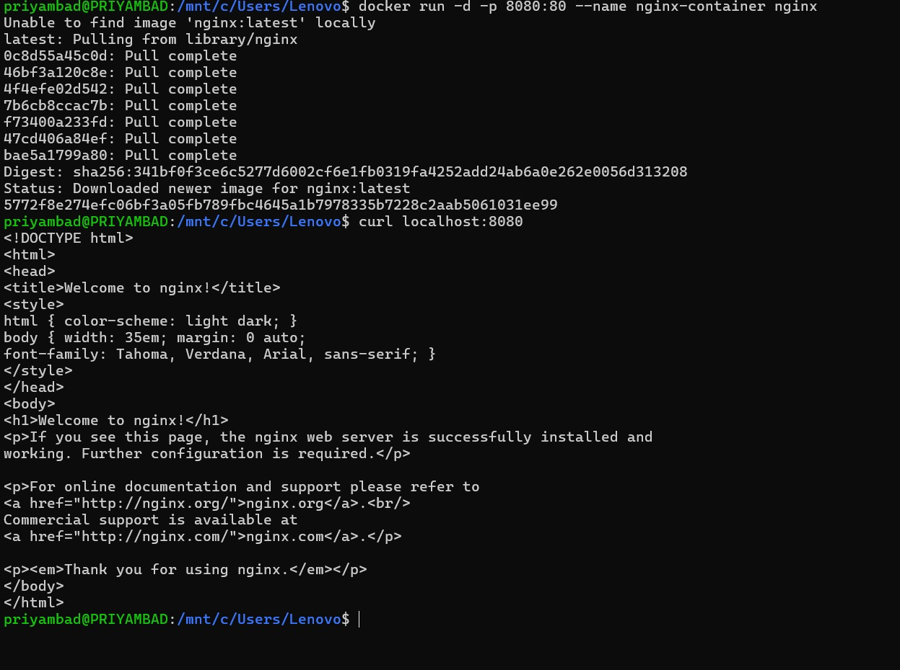

---

### Step 12: Compare VM and Container Performance
Observe startup time, memory usage, CPU consumption, and overall performance.  
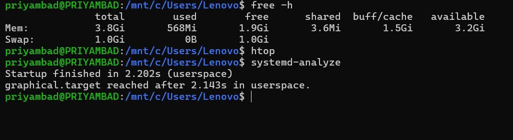
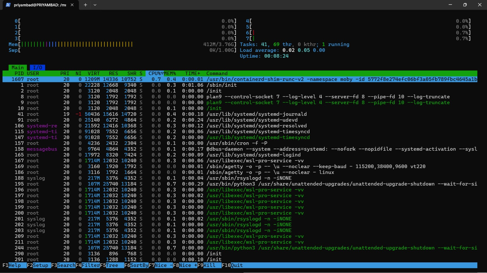

---

## Result
Ubuntu-based Nginx web server was successfully deployed on both Virtual Machine and Docker Container. The experiment demonstrated that containers are more lightweight and faster, while virtual machines provide stronger isolation with higher resource usage.

---

## Conclusion
This experiment highlights the key differences between Virtual Machines and Containers in terms of architecture, performance, and resource utilization, helping understand their appropriate use cases in modern computing environments.
