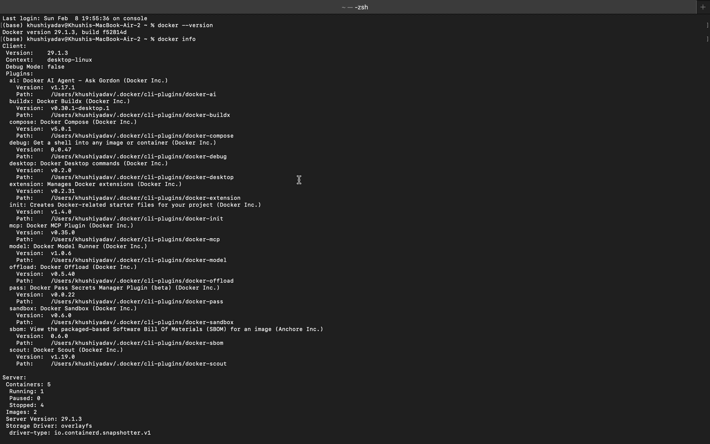
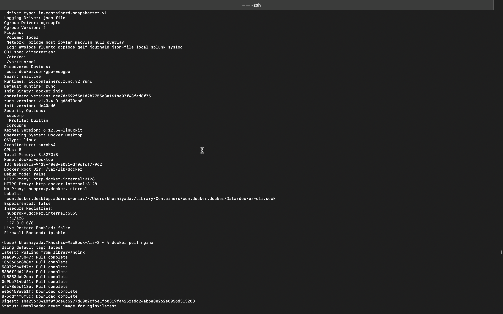
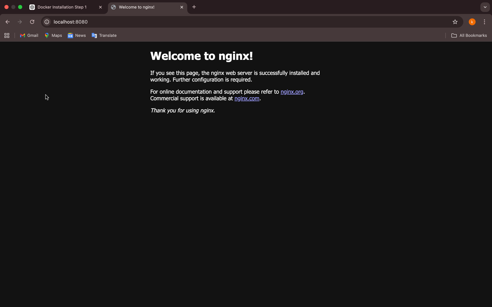
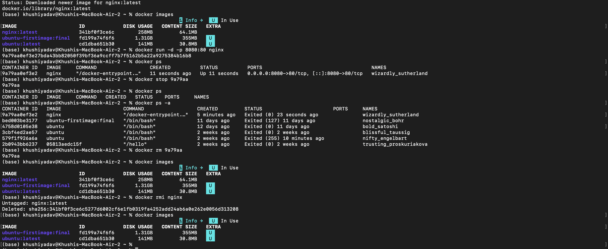

# Experiment 2: Docker Installation, Configuration, and Running Images

##  Objective
The objective of this experiment is to:
- Verify Docker installation and configuration on macOS
- Pull a Docker image from Docker Hub
- Run a Docker container with port mapping
- Access the running container using localhost
- Manage the container lifecycle (stop, remove)
- Remove Docker images after use

---

##  Commands Executed

### 1️.  Docker Installation & Configuration Check
The following commands were used to verify Docker installation and ensure that the Docker Engine was running:

```bash
docker --version
docker info
```


### 2. Pull Docker Image
The nginx image was pulled from Docker Hub using the following command:

```bash
docker pull nginx
```
To verify the downloaded image:

```bash
docker images
```



### 3. Run Docker Container with Port Mapping
The nginx container was started in detached mode with port mapping:

```bash
docker run -d -p 8080:80 nginx
```
To verify the running container:

```bash
docker ps
```


### 4. Container Lifecycle Management
The running container was stopped and removed using the following commands:

```bash
docker stop <container_id>
docker rm <container_id>
```
To verify stopped containers:

```bash
docker ps -a
```
### 5. Remove Docker Image
After removing the container, the nginx image was deleted:

```bash
docker rmi nginx
```



###  Result
Docker images were successfully pulled, containers were executed with port mapping, and container lifecycle commands were performed successfully.
###  Conclusion
This experiment demonstrated the use of Docker for containerization. It showed how Docker images are pulled from Docker Hub, containers are created and accessed using port mapping, and how Docker efficiently manages container lifecycle operations.
