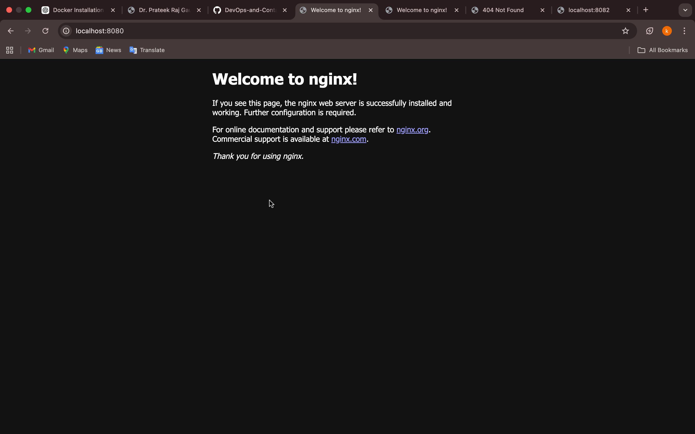
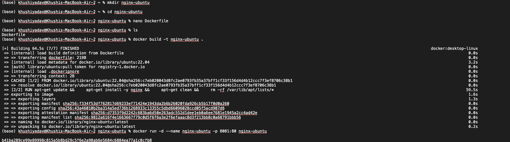
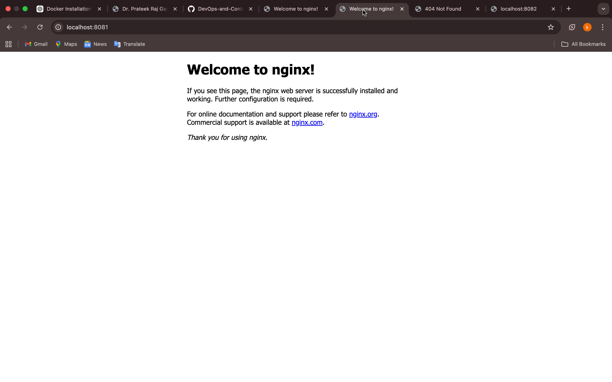
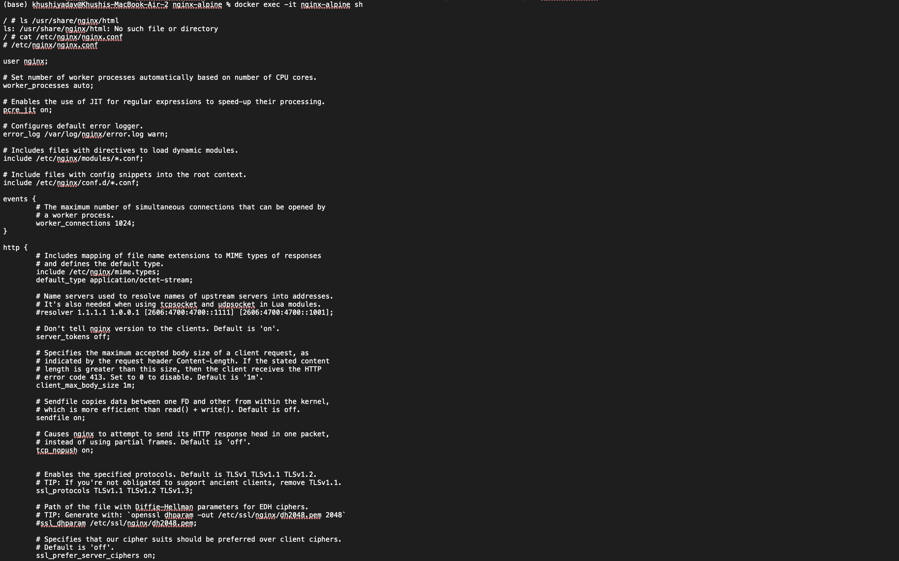
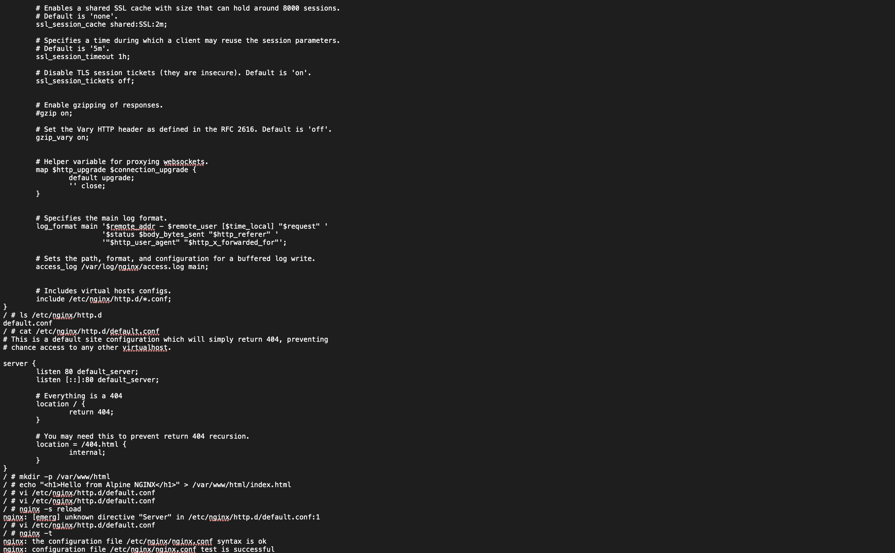
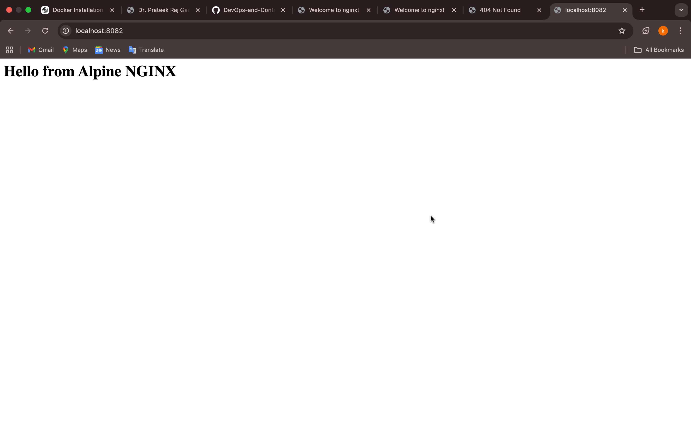
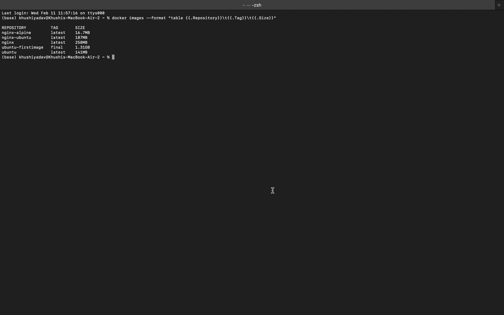

# Experiment 3: Deploying NGINX Using Different Base Images

##  Objective

To deploy NGINX using:
- Official NGINX Image
- Ubuntu-based Custom Image
- Alpine-based Custom Image

And compare:
- Image size
- Configuration behavior
- Docker layers
- Real-world use cases

---

#  Prerequisites

- Docker installed and running
- Basic Linux command knowledge
- Understanding of Dockerfile and port mapping

---

#  Part 1: Deploy NGINX Using Official Image

## Step 1: Pull Image

```bash
docker pull nginx:latest
```

## Step 2: Run Container

```bash
docker run -d --name nginx-official -p 8080:80 nginx
```


## Step 3: Verify

Open in browser:

```
http://localhost:8080
```

Output:
```
Welcome to nginx!
```

---

#  Part 2: Custom NGINX Using Ubuntu Base Image

## Step 1: Create Dockerfile

```dockerfile
FROM ubuntu:22.04

RUN apt-get update && \
    apt-get install -y nginx && \
    apt-get clean && \
    rm -rf /var/lib/apt/lists/*

EXPOSE 80

CMD ["nginx", "-g", "daemon off;"]
```

## Step 2: Build Image

```bash
docker build -t nginx-ubuntu .
```

## Step 3: Run Container

```bash
docker run -d --name nginx-ubuntu -p 8081:80 nginx-ubuntu
```


Verify in browser:

```
http://localhost:8081
```

Output:
```
Welcome to nginx!
```

---

#  Part 3: Custom NGINX Using Alpine Base Image

## Step 1: Create Dockerfile

```dockerfile
FROM alpine:latest

RUN apk add --no-cache nginx

EXPOSE 80

CMD ["nginx", "-g", "daemon off;"]
```

## Step 2: Build Image

```bash
docker build -t nginx-alpine .
```

## Step 3: Run Container

```bash
docker run -d --name nginx-alpine -p 8082:80 nginx-alpine
```

---

# Issue Faced in Alpine

After running:

```
http://localhost:8082
```

It showed:

```
404 Not Found
```

---

## 🔎 Debugging Process

### Checked Container

```bash
docker ps
```

Container was running.

### Entered Container

```bash
docker exec -it nginx-alpine sh
```

### Checked Default Config

```bash
cat /etc/nginx/http.d/default.conf
```

Found:

```nginx
server {
    listen 80 default_server;

    location / {
        return 404;
    }
}
```

Alpine default configuration intentionally returns 404.

---

#  Fix Applied

### Created Web Directory

```bash
mkdir -p /var/www/html
echo "<h1>Hello from Alpine NGINX</h1>" > /var/www/html/index.html
```

### Modified Configuration

```nginx
server {
    listen 80 default_server;

    root /var/www/html;
    index index.html;

    location / {
        try_files $uri $uri/ =404;
    }
}
```

### Tested Configuration

```bash
nginx -t
```

Output:
```
syntax is ok
test is successful
```

### Reloaded NGINX

```bash
nginx -s reload
```



Now browser showed:

```
Hello from Alpine NGINX
```

---

#  Image Size Comparison

Command used:

```bash
docker images --format "table {{.Repository}}\t{{.Tag}}\t{{.Size}}"
```

## Results:

| Image Type        | Size   |
|------------------|--------|
| nginx            | 258MB  |
| nginx-ubuntu     | 187MB  |
| nginx-alpine     | 16.7MB |


---

# Observations

- Alpine image is the smallest (16.7MB)
- Ubuntu image is larger due to full OS dependencies
- Official image is optimized but heavier than Alpine
- Alpine default configuration returns 404 intentionally
- Base image selection impacts:
  - Security
  - Performance
  - Image size
  - Startup time

---

#  Conclusion

In this experiment, NGINX was deployed using three different base images. The experiment demonstrated that base image selection significantly impacts container size and configuration behavior. Alpine-based images are lightweight and ideal for microservices and cloud environments, while Ubuntu-based images provide more debugging tools but increase image size. Official images are production-ready but may include additional modules.

This experiment highlights the importance of optimizing container images for performance and security in real-world deployments.

---

#  Cleanup Commands

```bash
docker stop nginx-official nginx-ubuntu nginx-alpine
docker rm nginx-official nginx-ubuntu nginx-alpine
docker rmi nginx nginx-ubuntu nginx-alpine
docker system prune -a
```

---

#  Key Learnings

- Docker image layering
- Base image impact on size
- NGINX configuration basics
- Debugging containerized applications
- Production vs minimal container strategies

