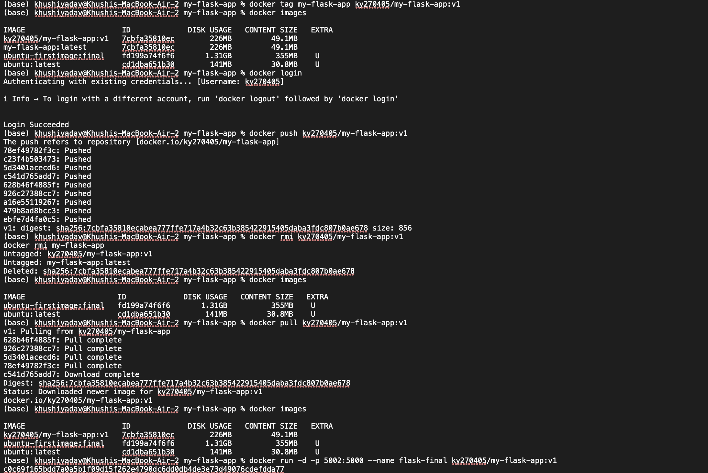

# Experiment 4 – Docker Essentials

## Aim
To containerize a Flask application using Docker, manage containers, and push the image to Docker Hub.

---

# Part 1 – Containerizing a Flask Application

## Step 1: Create Project Directory

```bash
mkdir my-flask-app
cd my-flask-app
```

---

## Step 2: Create Flask Application (app.py)

```python
from flask import Flask
app = Flask(__name__)

@app.route('/')
def hello():
    return "Hello from Docker!"

@app.route('/health')
def health():
    return "OK"

if __name__ == '__main__':
    app.run(host='0.0.0.0', port=5000)
```

---

## Step 3: Create requirements.txt

```
Flask==2.3.3
```

---

## Step 4: Create Dockerfile

```dockerfile
FROM python:3.9-slim

WORKDIR /app

COPY requirements.txt .

RUN pip install --no-cache-dir -r requirements.txt

COPY app.py .

EXPOSE 5000

CMD ["python", "app.py"]
```

---

## Step 5: Build Docker Image

```bash
docker build -t my-flask-app .
```

---

## Step 6: Run Container

```bash
docker run -d -p 5001:5000 --name flask-container my-flask-app
```

Access application:

```
http://localhost:5001
```

---

## Step 7: Test Health Endpoint

```
http://localhost:5001/health
```

---

## Step 8: View Logs

```bash
docker logs flask-container
```

---

## Step 9: Stop, Start and Remove Container

```bash
docker stop flask-container
docker start flask-container
docker rm -f flask-container
```

---

# Part 2 – Docker Hub Operations

## Step 10: Tag Image

```bash
docker tag my-flask-app ky270405/my-flask-app:v1
```

---

## Step 11: Login to Docker Hub

```bash
docker login
```

---

## Step 12: Push Image

```bash
docker push ky270405/my-flask-app:v1
```

---

## Step 13: Remove Local Image

```bash
docker rmi ky270405/my-flask-app:v1
docker rmi my-flask-app
```

---

## Step 14: Pull Image from Docker Hub

```bash
docker pull ky270405/my-flask-app:v1
```

---

## Step 15: Run Pulled Image

```bash
docker run -d -p 5002:5000 --name flask-final ky270405/my-flask-app:v1
```


Access:

```
http://localhost:5002
```

---

# Errors and Issues Faced

## ->  Docker Daemon Not Running

Error:
```
Cannot connect to the Docker daemon...
```

Reason:
Docker Desktop was not started.

Solution:
Started Docker Desktop and verified using:
```bash
docker version
```

---

## -> Port 5000 Already in Use

Error:
```
bind: address already in use
```

Reason:
Port 5000 was already used by a system process.

Solution:
Used a different port:
```bash
docker run -d -p 5001:5000 ...
```

---

## -> Container Name Already in Use

Error:
```
container name is already in use
```

Reason:
A container with the same name already existed.

Solution:
```bash
docker rm -f flask-container
```

---

# Results

- Successfully containerized a Flask application.
- Built Docker image.
- Ran container with port mapping.
- Managed container lifecycle.
- Tagged and pushed image to Docker Hub.
- Pulled and ran image successfully.

---

# Conclusion

The experiment successfully demonstrated Docker containerization, image management, port mapping, container lifecycle management, and integration with Docker Hub.
